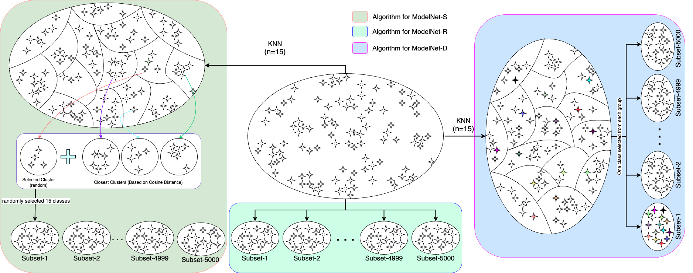
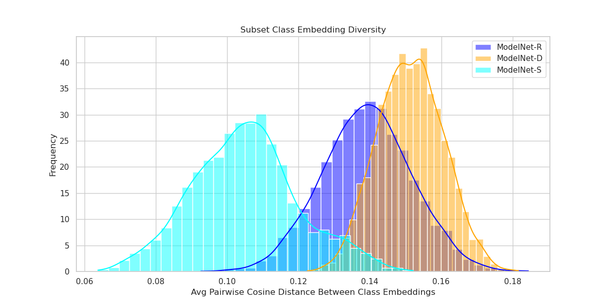
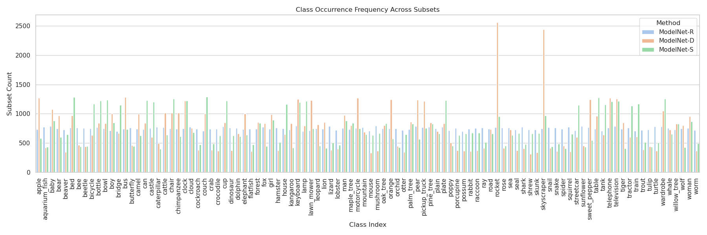
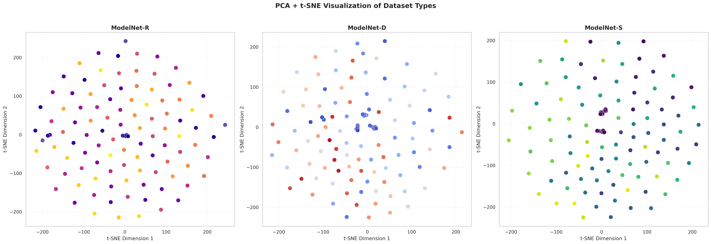
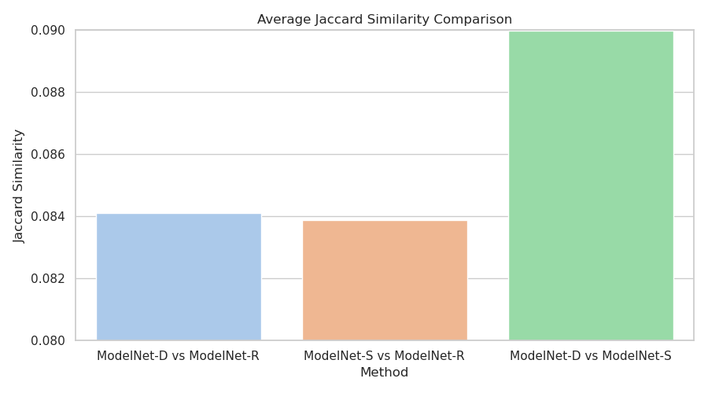
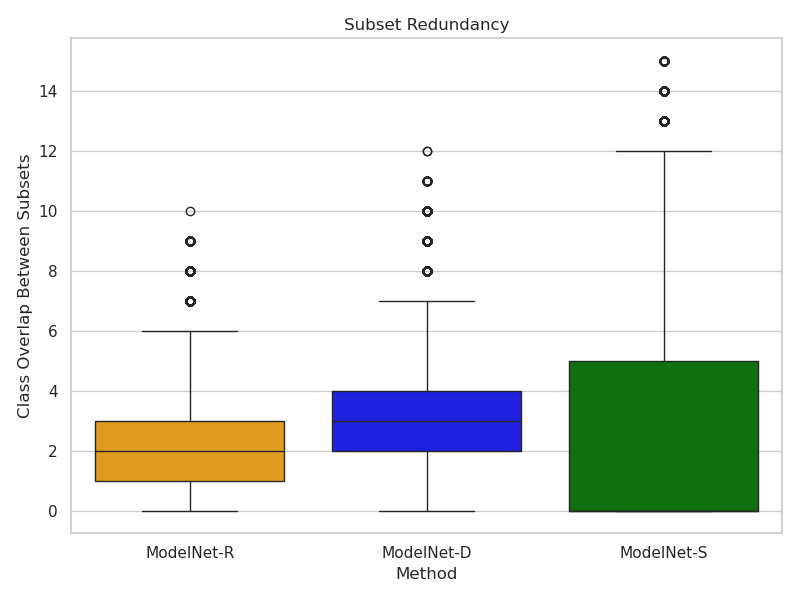
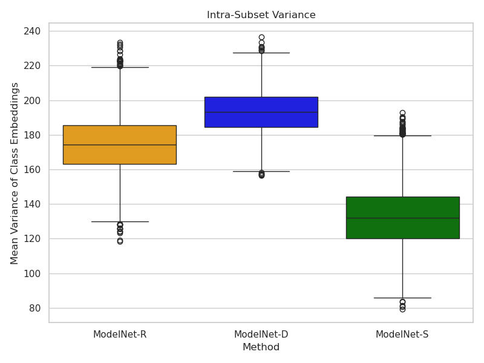
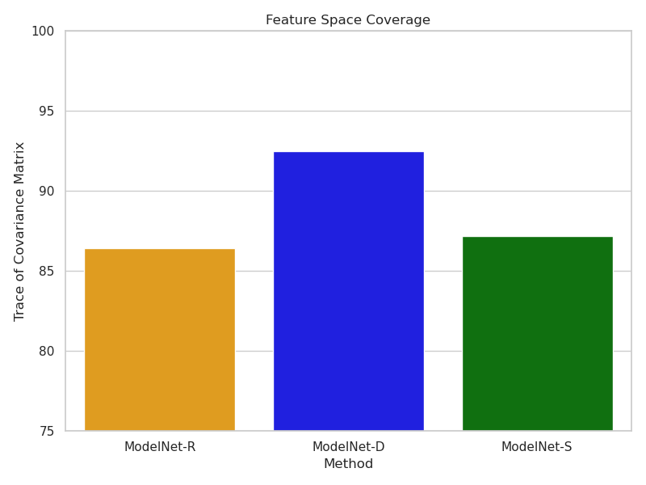

## [Towards Graph-Based Privacy-Preserving Federated Learning: ModelNet -- A ResNet-based Model Classification Dataset](https://arxiv.org/abs/2506.00476)<sup>1</sup>

[Abhisek Ray](https://scholar.google.co.in/citations?user=a7HOeC8AAAAJ&hl=en)<sup>1</sup>, [Lukas Esterle](https://arxiv.org/search/cs?searchtype=author&query=Esterle,+L)<sup>1</sup>

<sup>1</sup>Aarhus University, Denmark

[](https://arxiv.org/abs/2506.00476)
[](https://github.com/rayabhisek123/ModelNet)


⭐ If you find "**ModelNet**" helpful to your research, Don't forget to give a star to this repo. Thanks! 🤗

## :climbing: Updates
- ✅ 2025-05-31: Release the first version of the paper at Arxiv.
- ✅ 2025-06-09: Release the codes and results of ModelNet generation.
- ✅ 2025-06-11: Upload the image variants of ModelNet.
- [To Do] 2024-06-11: Upload the parameter variants of ModelNet.

<hr />


> **Abstract:** *Federated Learning (FL) has emerged as a powerful paradigm for training machine learning models across distributed data sources while preserving data locality. However, the privacy of local data is always a pivotal concern and has received a lot of attention in recent research on the FL regime. Moreover, the lack of domain heterogeneity and client-specific segregation in the benchmarks remains a critical bottleneck for rigorous evaluation. In this paper, we introduce ModelNet, a novel image classification dataset constructed from the embeddings extracted from a pre-trained ResNet50 model. First, we modify the CIFAR100 dataset into three client-specific variants, considering three domain heterogeneities (homogeneous, heterogeneous, and random). Subsequently, we train each client-specific subset of all three variants on the pre-trained ResNet50 model to save model parameters. In addition to multi-domain image data, we propose a new hypothesis to define the FL algorithm that can access the anonymized model parameters to preserve the local privacy in a more effective manner compared to existing ones. ModelNet is designed to simulate realistic FL settings by incorporating non-IID data distributions and client diversity design principles in the mainframe for both conventional and futuristic graph-driven FL algorithms. The three variants are ModelNet-S, ModelNet-D, and ModelNet-R, which are based on homogeneous, heterogeneous, and random data settings, respectively. To the best of our knowledge, we are the first to propose a cross-environment client-specific FL dataset along with the graph-based variant. Extensive experiments based on domain shifts and aggregation strategies show the effectiveness of the above variants, making it a practical benchmark for classical and graph-based FL research. The dataset and related code are available online.*
<hr />

## Results

- **Subset Diversity**

<br>
<p align="center">
  
  <br>
  Fig. Subset diversity of ModelNet-R, ModelNet-D, and ModelNet-S.
</p>
<be>


- **Class Occurrence Histogram**

<br>
<p align="center">
  
  <br>
  Fig.  Class occurrence histogram of ModelNet-R, ModelNet-D, and ModelNet-S.
</p>
<be>


- **t-SNE Plot**

<br>
<p align="center">
  
  <br>
  Fig. t-SNE plot of ModelNet-R, ModelNet-D, and ModelNet-S..
</p>
<be>


- **Jaccard Similarity**

<br>
<p align="center">
  
  <br>
  Fig. Jaccard similarity of ModelNet-R, ModelNet-D, and ModelNet-S..
</p>
<be>


- **Subset Redundancy**

<br>
<p align="center">
  
  <br>
  Fig. Subset redundancy of the ModelNet datasets.
</p>
<be>


- **Intra-subset Variance**

<br>
<p align="center">
  
  <br>
  Fig. Intra-subset variance of the ModelNet datasets.
</p>
<be>


- **Feature Space Coverage**

<br>
<p align="center">
  
  <br>
  Fig. Feature space coverage of the ModelNet datasets.
</p>
<be>

<hr />


## Dataset Link
  Download the image variants:

  > - [ModelNet-R](https://anon.erda.au.dk/sharelink/cJ2ouSkll3)
  > - [ModelNet-D](https://anon.erda.au.dk/sharelink/cJ2ouSkll3)
  > - [ModelNet-S](https://anon.erda.au.dk/sharelink/cJ2ouSkll3)

  Download the parameter variants:

  > - [ModelNet-R](https://anon.erda.au.dk/sharelink/HzTR72k6CZ)
  > - [ModelNet-D](https://anon.erda.au.dk/sharelink/HzTR72k6CZ)
  > - [ModelNet-S](https://anon.erda.au.dk/sharelink/HzTR72k6CZ)


<hr />

## Citations
#### BibTeX

```
@article{ray2025towards,
  title={Towards Graph-Based Privacy-Preserving Federated Learning: ModelNet-A ResNet-based Model Classification Dataset},
  author={Ray, Abhisek and Esterle, Lukas},
  journal={arXiv preprint arXiv:2506.00476},
  year={2025}
}

```
<hr />


## License

This project is licensed under the [MIT License](https://opensource.org/licenses/MIT) and was originally developed by [@abhisek-ray](https://github.com/rayabhisek123).

<hr />

## Contact
If you have any questions, please email rayabhisek0610@gmail.com to discuss with the authors.


